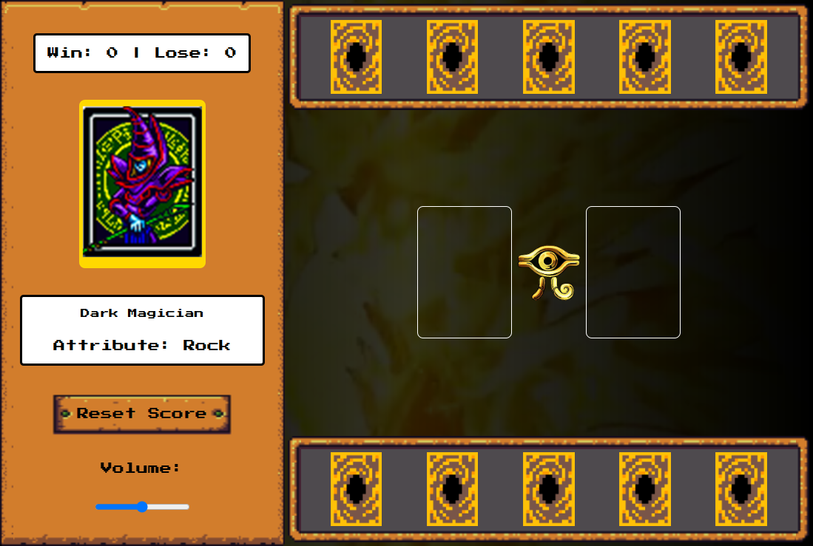

#  Yu-Gi-Oh Jo-kem-po Edition

Bem-vindo ao projeto Yu-Gi-Oh Jo-kem-po Edition! Neste jogo, você pode desafiar um oponente virtual em uma divertida versão de Jo-Ken-Pô, utilizando cartas do universo Yu-Gi-Oh apenas para visualização.



## Índice

- Objetivo
- Descrição do Projeto
- Como Utilizar
- Tecnologias Utilizadas
- Estrutura do Projeto
- Funcionalidades
- Funcionalidades Futuras
- Contribuições
- Contato
- Observações

## 🎯 Objetivo

O objetivo deste projeto é criar uma versão interativa do clássico jogo de Jo-Ken-Pô, utilizando cartas do Yu-Gi-Oh como visualização. Os jogadores se enfrentam com as regras tradicionais de Jo-Ken-Pô, proporcionando uma experiência divertida e nostálgica.

## 📖 Descrição do Projeto 

Yu-Gi-Oh Jo-kem-po Edition é um jogo web onde o jogador compete contra um oponente virtual em uma partida de Jo-Ken-Pô. As cartas do Yu-Gi-Oh são utilizadas apenas para representação visual, enquanto as regras do jogo seguem a dinâmica clássica do Jo-Ken-Pô. O projeto visa unir a paixão por jogos de cartas e a diversão do Jo-Ken-Pô em uma interface amigável e intuitiva.

## 🕹️ Como Utilizar

1. **Acessar a Página**:
   - Acesse a aplicação hospedada clicando [aqui](https://yugioh-cards-eta.vercel.app/).
   - Ou abra o arquivo `index.html` localmente no navegador para visualização offline.

2. **Iniciar o Jogo**:
   - Navegue pelas cartas para escolher sua primeira jogada.

3. **Interagir com as Cartas**:
   - Clique na carta para jogá-la e desafiar o computador.

4. **Resetar o Jogo**:
   - Utilize o botão de reset para reiniciar a partida se for preciso.

5. **Finalização**:
   - O jogo termina quando um dos jogadores atinge 5 pontos. Um alerta será exibido ao final do jogo, indicando o vencedor.

## 🛠️ Tecnologias Utilizadas 


 

- **HTML5**: Para a estruturação do conteúdo.
- **CSS3**: Para estilização e design responsivo.
- **JavaScript**: Para a lógica do jogo e interação com o usuário.

## 🗂️ Estrutura do Projeto 

A organização dos arquivos no projeto é a seguinte:

```
| index.html
| README.md
| src/
| ├── assets/
| │   ├── audios/
| │   ├── cursor/
| │   ├── favicon/
| │   ├── icons/
| │   ├── rpg/
| │   └── video/
| ├── scripts/
| │   └── engine.js
| └── styles/
|     ├── buttons.css
|     ├── containers_and_frames.css
|     ├── main.css
|     └── reset.css
```

## ⚙️ Funcionalidades 

- Jogo interativo de Jo-Ken-Pô entre um jogador e o computador.
- Alerta para indicar o vencedor ao final do jogo.
- Efeito de confete quando o jogador vence.
- Visualização de cartas do Yu-Gi-Oh.

## 🌟 Funcionalidades Futuras

- Tornar o projeto totalmente responsivo para melhor adaptação a diferentes dispositivos.
- Inclusão de mais cartas do Yu-Gi-Oh para diversificar as jogadas e experiências de jogo.
- Implementação de novas possibilidades de jogadas, como combinações de cartas ou modos de jogo alternativos.
- Utilização de uma API externa para trazer cartas dinâmicas e atualizadas do universo Yu-Gi-Oh.

## 🤝 Contribuições

Contribuições são bem-vindas! Para contribuir:

- **Abra uma Issue:** Relate um bug ou sugira uma melhoria.
- **Crie um Pull Request:** Faça alterações no código e envie uma solicitação para revisão.

## 📧 Contato

Para dúvidas ou feedback, entre em contato:

- **E-mail:** [nina.kastro@icloud.com](mailto:nina.kastro@icloud.com)
- **LinkedIn:** [LinkedIn](https://www.linkedin.com/in/karinacmartins/)
- **GitHub:** [GitHub](https://github.com/karinacmartins)

## Observações

Este projeto é um desafio do bootcamp na DIO e está em constante melhoria.

<br>
<br>

<div align="right">Made with 💜 by <a href="https://github.com/karinacmartins">KM</a>.</div>
